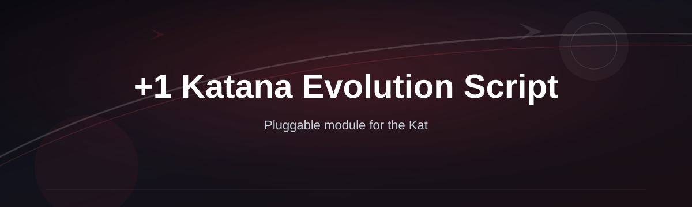
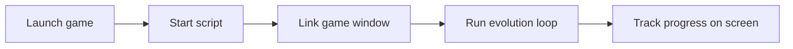

# katana-evolution-script

*A small Windows tool for players grinding the +1 Katana evolution chain who want a steadier, less repetitive path to the next tier.*

**The +1 Katana Evolution Script exists because the manual grind for katana upgrades is slow, repetitive, and easy to mess up by hand.**

Read the full story behind this tool

 

This started as a personal utility. Evolving a katana past its first tiers usually means repeating the same sequence dozens or hundreds of times — collect materials, trigger the evolution prompt, confirm, wait, repeat. Doing that by hand for an hour is fine once. Doing it every session gets old fast, and it's easy to miss a step or waste a resource on a bad attempt.

The script grew out of tracking that sequence manually in a spreadsheet, then automating the repetitive parts one piece at a time. What's shared here is the cleaned-up, standalone version: no accounts, no background services, just a program you run alongside your game session when you want to work through the evolution steps without babysitting every click.

## What this is

The +1 Katana Evolution Script is a standalone Windows program that automates the repetitive steps involved in evolving a starter katana through its upgrade tiers. Instead of manually repeating the same sequence of actions each time you want to push your katana forward, the script handles the timing and repetition for you while you stay in control of when it starts and stops.

It's built as a single executable with no installer, no login, and no dependency on other software. You download it, point it at your running game window, and let it work through the evolution loop at a pace you set. It doesn't touch save files or modify the game itself — it interacts the same way a player would, just faster and more consistently.

  

The button above opens the project's download page, where you'll find the current build.

## Who it is for

- Players trying to push a starter katana through multiple evolution tiers in one sitting
- People who play in short bursts and don't want to spend that time on repetitive clicking
- Anyone comparing evolution progress across alt accounts and wanting consistent timing between runs
- Streamers or content creators who need to reach a specific katana tier for a video without an hour of setup
- Players returning after a break who want to catch an evolved katana up to their main progress

## What you can do

- **Automate the repeat sequence** needed to push a katana through each evolution stage
- **Set your own pacing** so the script matches how your specific game session behaves
- **Pause and resume instantly** with a hotkey, without closing the tool or losing your place
- **Run it alongside the game window** without alt-tabbing or minimizing anything
- **Track evolution attempts** in a simple on-screen counter while it runs
- **Stop cleanly at any point** and pick up later from where you left off
- **Use it with a fresh or existing katana** — it doesn't require a specific starting tier
- **Keep your game session untouched** — no file edits, no save modifications

## Getting started

1. Open the download page using the button above.
2. Grab the latest build for Windows.
3. Extract the file to any folder — no installation step needed.
4. Launch your game first, then run the script's executable.
5. Follow the on-screen prompt to link it to your game window, then start the evolution loop.

## Requirements

- Windows 10 or Windows 11 (64-bit)
- No .NET, Python, or Node toolchain to install
- No account, license key, or internet connection required to run it
- A few hundred megabytes of free disk space for the extracted files

## How it works

The script watches your game window, replays the evolution sequence at the interval you set, and reports progress back to you in a small status panel.

1. You start the game and get your katana to a state where it can begin evolving.
2. You launch the script and select your game window from the prompt.
3. The script repeats the evolution sequence at your chosen pace.
4. You watch the counter and pause whenever you want to check in-game progress.
5. You stop the script once you've reached the tier you were aiming for.

## FAQ

**What does the +1 Katana Evolution Script actually automate?**
It repeats the sequence of in-game actions needed to advance a katana through its evolution tiers — the same steps you'd do manually, just without you clicking through each one.

**Is the +1 Katana Evolution Script safe to run on my main account?**
It only simulates normal player input and doesn't modify game files, but any automation carries some risk depending on the game's own rules. Use your own judgment about which account you run it on.

**Does it work with every katana evolution chain, or only specific tiers?**
It's built around the general evolution loop and works from a fresh katana onward. It doesn't require the katana to already be at a particular tier.

**Do I need to install any extra software for it to run?**
No. It's a standalone executable — no Python, no browser extensions, no separate runtime.

**Why isn't the script progressing my katana even though it's running?**
Usually this means the game window lost focus or moved after you linked it. Re-link the window from the script's prompt and try again.

## Troubleshooting

**Windows SmartScreen blocks the file on first run.**
Click "More info," then "Run anyway." This is standard behavior for new, unsigned executables and doesn't indicate a problem with the file itself.

**The script doesn't detect my game window.**
Make sure the game is running and visible (not minimized) before you launch the script, then use the window-selection prompt again.

**Evolution attempts aren't registering in-game.**
Check that your game window is at its default size or a supported resolution — unusual window scaling can throw off the timing.

**Antivirus quarantines the download.**
Automation tools are commonly flagged by generic heuristics. Restore it from quarantine or add an exception if you trust the source you downloaded it from.

## License

This project is released under the [MIT License](LICENSE). It's provided as-is, with no warranty — use it at your own discretion and in line with the rules of the game you're playing.

  

